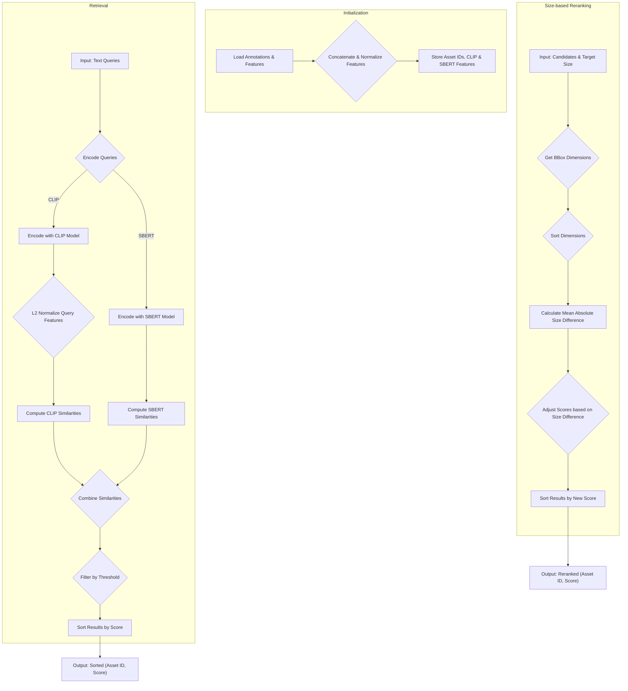

# Objaverse Retriever System Diagram and Mathematical Operations

This document explains the system architecture and mathematical calculations used in the `ObjaverseRetriever` class from [`References/objaverse_retriever.py`](References/objaverse_retriever.py).

## System Diagram (Mermaid)

## Mathematical Operations

The retriever uses a combination of CLIP and SBERT models to find relevant 3D assets based on text queries. The similarity scores are then optionally adjusted based on the object's size.

### 1. Feature Initialization (`__init__`)

During initialization, the retriever loads pre-computed CLIP and SBERT features for a database of objects.

-   **Feature Normalization**: The CLIP image features are L2-normalized. This is a crucial step for using the dot product to calculate cosine similarity. For a feature vector **v**, the normalized vector **v_norm** is:

    $$ \mathbf{v}_{\text{norm}} = \frac{\mathbf{v}}{\|\mathbf{v}\|_2} $$

    Where `||v||_2` is the Euclidean (L2) norm of the vector. This ensures that each feature vector has a magnitude of 1.

### 2. Asset Retrieval (`retrieve`)

This method calculates the similarity between input text queries and the assets in the database.

-   **Query Feature Normalization**: The CLIP text features for the input queries are also L2-normalized, same as the image features.

-   **CLIP Similarity**: The similarity between the query text features and the asset image features is calculated using `torch.einsum`. The operation `torch.einsum("ij, lkj -> ilk", query_feature_clip, self.clip_features)` computes a batched dot product. Let **q_i** be the feature vector for the *i*-th query, and **a_{lk}** be the feature vector for the *k*-th view of the *l*-th asset. The similarity is:

    $$ \text{sim}_{\text{CLIP}}(i, l, k) = 100 \cdot (\mathbf{q}_i \cdot \mathbf{a}_{lk}) $$

    Since the features are normalized, this dot product is equivalent to the cosine similarity. The result is then aggregated by taking the maximum similarity across all views (`k`) for each query-asset pair (`i`, `l`).

    $$ \text{CLIP\_Sim}(i, l) = \max_{k} \left( \text{sim}_{\text{CLIP}}(i, l, k) \right) $$

-   **SBERT Similarity**: The SBERT similarity is calculated using a standard matrix multiplication between the query features and the transposed asset features. This also computes the cosine similarity as SBERT model outputs are often normalized or used in a cosine similarity context.

    $$ \text{SBERT\_Sim} = \mathbf{Q}_{\text{SBERT}} \cdot \mathbf{A}_{\text{SBERT}}^T $$

    Where **Q_SBERT** is the matrix of query features and **A_SBERT** is the matrix of asset features.

-   **Combined Similarity**: The final similarity score is the sum of the CLIP and SBERT similarities.

    $$ \text{TotalSim}(i, l) = \text{CLIP\_Sim}(i, l) + \text{SBERT\_Sim}(i, l) $$

### 3. Size-based Score Adjustment (`compute_size_difference`)

This method refines the ranking of candidate assets by penalizing those with sizes that differ significantly from a target size.

-   **Size Difference Calculation**: For each candidate asset, its bounding box dimensions (`x`, `y`, `z`) are extracted and sorted. The target size dimensions are also sorted. This makes the comparison invariant to orientation. The size difference is the mean of the absolute differences between the corresponding sorted dimensions.

    Let **S_target** = `sorted([tx, ty, tz])` and **S_cand** = `sorted([cx, cy, cz])`.

    $$ \text{SizeDiff} = \frac{1}{3} \sum_{j=1}^{3} |\mathbf{S}_{\text{cand}}[j] - \mathbf{S}_{\text{target}}[j]| $$

-   **Score Adjustment**: The initial retrieval score is penalized by the calculated size difference, multiplied by a scaling factor (10 in the code).

    $$ \text{NewScore} = \text{OldScore} - 10 \cdot \text{SizeDiff} $$

The candidates are then re-sorted based on this new, size-adjusted score.