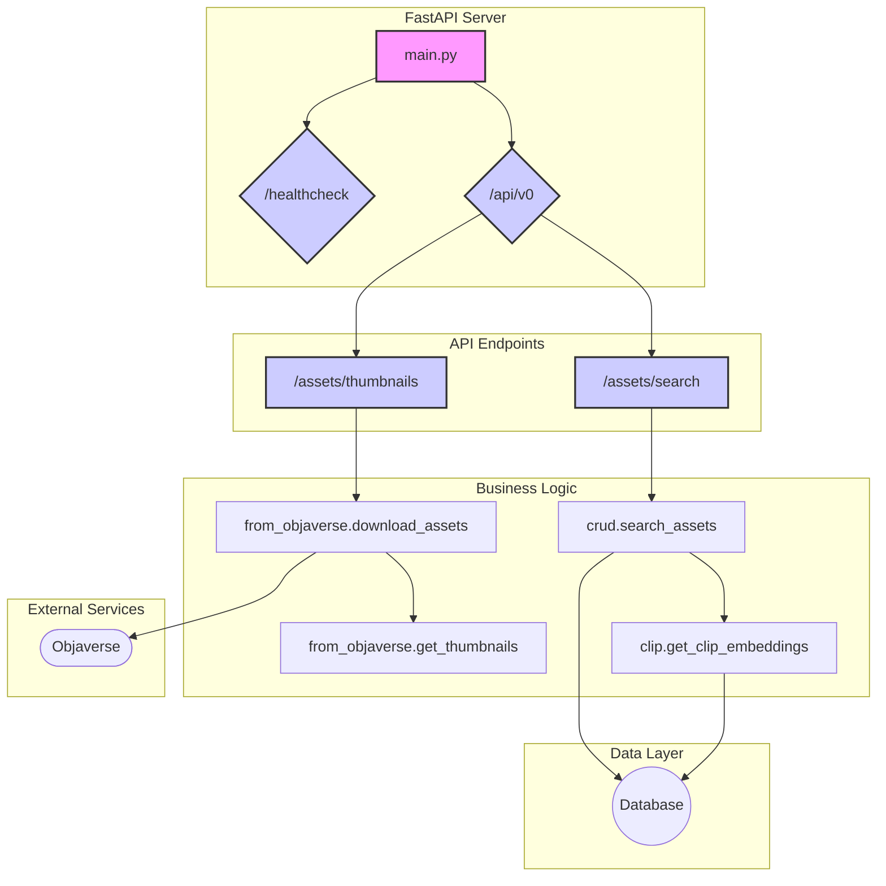

```mermaid
graph TD
    subgraph "FastAPI Server"
        A[main.py] --> B{/healthcheck};
        A --> C{/api/v0};
    end

    subgraph "API Endpoints"
        C --> D["/assets/search"];
        C --> E["/assets/thumbnails"];
    end

    subgraph "Business Logic"
        D --> F[crud.search_assets];
        E --> G[from_objaverse.download_assets];
        G --> H[from_objaverse.get_thumbnails];
        F --> I[clip.get_clip_embeddings];
    end

    subgraph "Data Layer"
        F --> J((Database));
        I --> J;
    end

    subgraph "External Services"
        G --> K([Objaverse]);
    end

    style A fill:#f9f,stroke:#333,stroke-width:2px;
    style B fill:#ccf,stroke:#333,stroke-width:2px;
    style C fill:#ccf,stroke:#333,stroke-width:2px;
    style D fill:#ccf,stroke:#333,stroke-width:2px;
    style E fill:#ccf,stroke:#333,stroke-width:2px;
```
